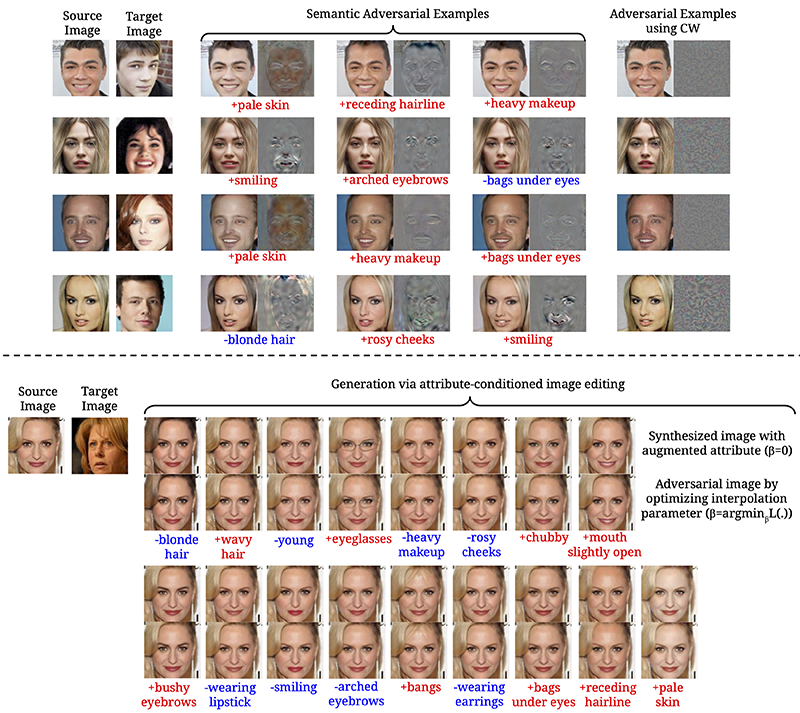
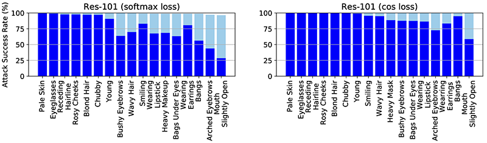
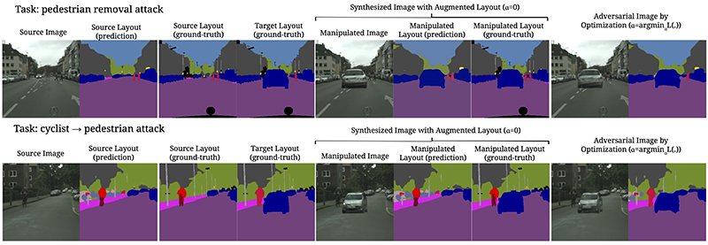

# SemanticAdv (ECCV 2020)

This is official PyTorch implementation of ECCV 2020 paper [SemanticAdv: Generating Adversarial Examplesvia Attribute-conditioned Image Editing](https://arxiv.org/abs/1906.07927) by Haonan Qiu, Chaowei Xiao, Lei Yang, Xinchen Yan, Honglak Lee, Bo Li.

Please follow the instructions to run the code.

### Overview
 ```
 --attacks    #core function for SemanticAdv
 --Face       #demo on face (CelebA) verification task
 --Street     #demo on street (Cityscapes) segmentation task
 ```

### Core Function (embed it in your own model)
 ```
 from attacks import semantic_attack
 
 adversary = semantic_attack.FP_CW_TV(learning_rate, 
                                      maximal_iteration,
                                      lambda_for_tv_loss,
                                      threshold) 
 
 adv_images, adv_loss, tv_loss = adversary(G_dec=decoder,
                                           emb1=feature_map1,
                                           emb2=feature_map2,
                                           model=target_model,
                                           loss_func=loss_function,
                                           target_label=target_label,
                                           targeted=True)
 ```

### Set Environment

If you are using Conda and CUDA 10.0, run the code below directly. Otherwise, modify the corresponding line to install PyTorch and torchvision following the [official instructions](https://pytorch.org/).
 ```
 bash scripts/set_env.sh
 
 # Tested in the below environment
 # pytorch==1.1.0
 # torchvision==0.3.0
 # scipy==1.2.1
 # pillow=6.1.0
 # dominate=2.4.0
 # scikit-image=0.16.2
 ```

### Attack for Face Verification

- Enter the folder of face verification
 ```
 cd Face
 ```
- Download the pre-trained generative model and verification model
 ```
 bash scripts/download_pretrained_face_model.sh
 ```
- Run targeted attack demo
 ```
 bash scripts/verification_attack_demo.sh
 ```
- Run untargeted attack demo
 ```
 bash scripts/verification_attack_untarget_demo.sh
 ```
 
See [Face/README.md](Face/README.md) for more explaination of attack for face verification. All options are in the [Face/verification_attack.py](Face/verification_attack.py).



- Run the following lines to reproduce results in the ECCV paper
 ```
 bash scripts/download_all_aligned_images.sh
 bash scripts/verification_attack_reproduction_e3.sh
 ```
 

 
#### reference repo

generative model (StarGAN)  
https://github.com/yunjey/stargan

verification model  
https://github.com/yl-1993/hfsoftmax 

### Attack for Semantic Segmentation

- Enter the folder of semantic segmentation
 ```
 cd Street
 ```
- Download the pre-trained generative model and segmentation model
 ```
 bash scripts/download_pretrained_mask2image_city.sh
 bash scripts/download_pretrained_seg_model.sh
 ```
- Run targeted attack demo
 ```
 bash scripts/attack_seg_p11.sh
 ```
 

 
#### reference repo

generative model  
https://github.com/xcyan/neurips18_hierchical_image_manipulation

segmentation model (DRN)  
https://github.com/fyu/drn

## Citation
If you find this useful, please cite our work as follows:
```
@inproceedings{qiu2019semanticadv,
  title={Semanticadv: Generating adversarial examples via attribute-conditioned image editing},
  author={Qiu, Haonan and Xiao, Chaowei and Yang, Lei and Yan, Xinchen and Lee, Honglak and Li, Bo},
  booktitle={ECCV},
  year={2020}
}
```
## Acknowledgements
We would like to thank the amazing developers and the open-sourcing community. Our implementation has especially been benefited from the following excellent repositories:
* StarGAN Model: [https://github.com/yunjey/stargan](https://github.com/yunjey/stargan)
* Face Verification Model: [https://github.com/yl-1993/hfsoftmax](https://github.com/yl-1993/hfsoftmax) 
* Hierachical Image Editing: [https://github.com/xcyan/neurips18_hierchical_image_manipulation](https://github.com/xcyan/neurips18_hierchical_image_manipulation)
* DRN Segmentation Model: [https://github.com/fyu/drn](https://github.com/fyu/drn)
